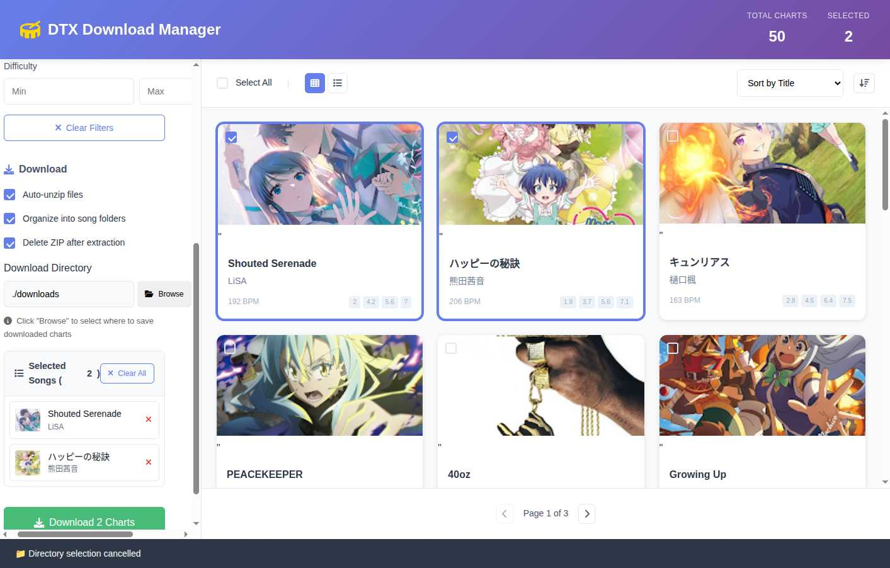

# DTX Download Manager

A modern, feature-rich web application for downloading and managing DTX charts with real-time progress tracking, intelligent file organization, and cross-browser directory selection support.



> ![NOTE]
> The vast majority of this repository was generated using Github copilot. I had originally implemented a script to aggregate dtxmania charts and auto download them. AI was used to recreate the script with more features.

## ✨ Features

### 🎯 Chart Management
- **Visual Chart Browser**: Beautiful grid layout with high-quality album artwork
- **Advanced Filtering**: Search by title, artist, BPM range, and difficulty
- **Smart Selection**: Multi-select charts with visual feedback
- **Comprehensive Database**: Browse extensive collection of DTX charts
- **Real-time Statistics**: Live chart counts and selection tracking

### 📁 Smart Directory Selection
- **File System Access API**: Modern directory picker for Chrome/Edge
- **Webkitdirectory Fallback**: Universal browser support for Firefox/Safari
- **Manual Path Input**: Traditional text input as final fallback
- **Visual Feedback**: Clear status messages and help text

### ⚡ Real-time Progress Tracking
- **Server-Sent Events (SSE)**: Live download progress updates
- **Individual Chart Progress**: Track each download separately
- **Connection Status**: Real-time backend connectivity indicator
- **Error Handling**: Comprehensive error reporting and recovery

### 🎵 Intelligent File Organization
- **Smart ZIP Extraction**: Automatic detection of existing folder structures
- **DTXMania Compatible**: Organized folder structure for easy importing
- **Duplicate Prevention**: Avoids unnecessary nested folders
- **Optional Metadata**: Chart info files when needed

### 🔧 Download Options
- **Auto-unzip**: Automatic extraction of downloaded ZIP files
- **Song Folder Organization**: Clean, organized file structure
- **ZIP Cleanup**: Optional deletion of ZIP files after extraction
- **Custom Directory**: User-specified download locations

## 🚀 Getting Started

### Prerequisites
- Node.js (v16 or higher)
- npm or yarn package manager

### Installation

1. Clone the repository:
```bash
git clone https://github.com/MistOfJudgement/dtx-download-manager.git
cd dtx-download-manager
```

2. Install dependencies:
```bash
npm install
```

3. Build the TypeScript files:
```bash
npm run build
```

4. Start the server:
```bash
npm start
```

5. Open your browser and navigate to:
```
http://localhost:3001/gui
```

## 🖥️ Interface Overview

### Main Dashboard
The application features a clean, modern interface with:
- **Header Bar**: Application title with live chart statistics
- **Sidebar**: Database management, filters, and download controls
- **Main Area**: Chart grid with sorting and view options
- **Status Bar**: Backend connection and operation status

### Chart Selection
- Click any chart to add it to your selection
- Selected charts appear in the sidebar with thumbnails
- Real-time selection counter updates
- Easy removal with individual delete buttons

### Directory Selection
The enhanced directory picker offers three fallback methods:
1. **File System Access API** (Chrome 86+, Edge 86+)
2. **Webkitdirectory** (Firefox, Safari, older browsers)
3. **Manual text input** (universal fallback)

## 🌐 Browser Compatibility

| Feature | Chrome/Edge | Firefox | Safari | Other |
|---------|-------------|---------|--------|-------|
| File System Access API | ✅ | ❌ | ❌ | ❌ |
| Webkitdirectory | ✅ | ✅ | ✅ | ⚠️ |
| Manual Input | ✅ | ✅ | ✅ | ✅ |
| Real-time Progress | ✅ | ✅ | ✅ | ✅ |

## 🔧 Technical Architecture

### Frontend Stack
- **Vanilla JavaScript**: Lightweight, no framework dependencies
- **Modern CSS**: Grid layouts, flexbox, custom properties
- **EventSource API**: Server-Sent Events for real-time updates
- **File System APIs**: Progressive enhancement for directory selection

### Backend Stack
- **Node.js + Express**: RESTful API server
- **TypeScript**: Type-safe server-side code
- **SQLite Database**: Chart metadata storage
- **Stream Processing**: Efficient file handling

### Key Components

#### Real-time Progress System
```javascript
// Server-Sent Events connection
connectToProgressStream(downloadId) {
    const eventSource = new EventSource(`/api/downloads/progress/${downloadId}`);
    eventSource.onmessage = (event) => {
        const progress = JSON.parse(event.data);
        this.updateProgressUI(progress);
    };
}
```

#### Smart Directory Selection
```javascript
// Triple fallback strategy
async selectDownloadDirectory() {
    try {
        // 1. Try File System Access API
        if ('showDirectoryPicker' in window) {
            return await window.showDirectoryPicker();
        }
        // 2. Fallback to webkitdirectory
        return await this.showWebkitDirectoryPicker();
    } catch (error) {
        // 3. Manual input fallback
        return this.showManualInput();
    }
}
```

#### Intelligent File Organization
```javascript
// Smart ZIP extraction with folder detection
organizeExtractedFiles(extractPath, chartData) {
    const contents = fs.readdirSync(extractPath);
    const hasExistingFolder = contents.some(item => 
        fs.statSync(path.join(extractPath, item)).isDirectory()
    );
    
    if (hasExistingFolder) {
        // Files already organized, move as-is
        return this.moveExistingStructure(extractPath, targetPath);
    } else {
        // Create new song folder
        return this.createSongFolder(extractPath, chartData, targetPath);
    }
}
```

## 📝 API Endpoints

### Chart Management
- `GET /api/charts` - List all charts with filtering
- `GET /api/charts/search` - Search charts by query
- `POST /api/charts/scrape` - Scrape new charts from sources

### Download Operations
- `POST /api/downloads` - Start download operation
- `GET /api/downloads/progress/:id` - SSE progress stream
- `GET /api/downloads/:id/status` - Download status

### Database Operations
- `POST /api/database/import` - Import chart database
- `DELETE /api/database/clear` - Clear all data
- `GET /api/database/stats` - Database statistics

## 🎛️ Configuration

### Download Settings
```javascript
// Default configuration
const downloadConfig = {
    autoUnzip: true,
    organizeIntoFolders: true,
    deleteZipAfterExtraction: true,
    downloadDirectory: './downloads',
    createChartInfo: false
};
```

### Server Configuration
```javascript
// Server settings
const serverConfig = {
    port: 3001,
    host: 'localhost',
    cors: true,
    maxConcurrentDownloads: 5
};
```

## 🐛 Troubleshooting

### Common Issues

**Directory selection not working**
- Ensure you're using HTTPS (required for File System Access API)
- Try the manual input fallback
- Check browser console for permission errors

**Downloads not starting**
- Verify backend server is running on port 3001
- Check network connectivity indicator in status bar
- Ensure selected directory has write permissions

**Progress not updating**
- Confirm Server-Sent Events are supported
- Check for browser ad-blockers blocking event streams
- Verify firewall isn't blocking the progress endpoint

### Development Setup

For development with hot reloading:

```bash
# Terminal 1 - TypeScript compilation
npm run dev

# Terminal 2 - Server with nodemon
npm run serve

# Terminal 3 - File watching (optional)
npm run watch
```

## 🤝 Contributing

1. Fork the repository
2. Create a feature branch: `git checkout -b feature/amazing-feature`
3. Commit your changes: `git commit -m 'Add amazing feature'`
4. Push to the branch: `git push origin feature/amazing-feature`
5. Open a Pull Request

## 📄 License

This project is licensed under the MIT License - see the [LICENSE](LICENSE) file for details.

## 🙏 Acknowledgments

- **GitHub Copilot**: This repository was created and enhanced using GitHub Copilot, transforming a simple implementation into a feature-rich, production-ready application
- DTXMania community for chart creation and sharing
- Modern web APIs for enabling advanced directory selection
- Contributors and testers who helped improve the application

---

**Ready to download your favorite DTX charts?** Start the server and open `http://localhost:3001/gui` to begin!
