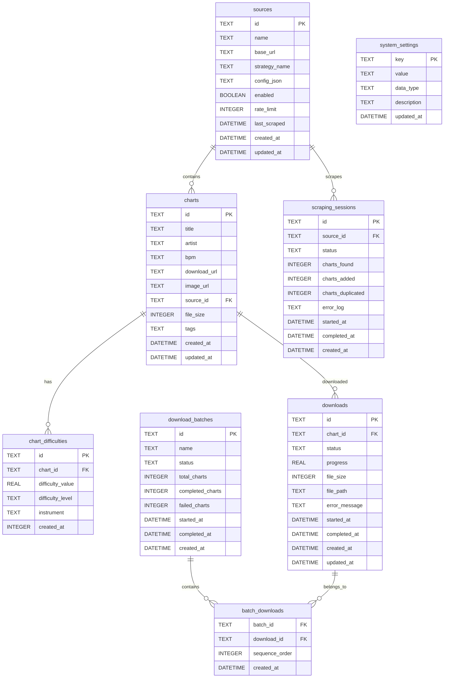

# Database Schema Design

## Overview

The database uses SQLite for simplicity and portability, with a normalized schema that supports efficient querying and maintains data integrity.

## Entity Relationship Diagram



## Table Definitions

### charts

Core chart information table.

```sql
CREATE TABLE charts (
    id TEXT PRIMARY KEY DEFAULT (hex(randomblob(16))),
    title TEXT NOT NULL,
    artist TEXT NOT NULL,
    bpm TEXT NOT NULL,
    download_url TEXT NOT NULL UNIQUE,
    image_url TEXT,
    source_id TEXT NOT NULL REFERENCES sources(id),
    file_size INTEGER,
    tags TEXT, -- JSON array of tags
    created_at DATETIME DEFAULT CURRENT_TIMESTAMP,
    updated_at DATETIME DEFAULT CURRENT_TIMESTAMP,
    
    -- Indexes for common queries
    UNIQUE(title, artist, source_id) -- Prevent duplicates within source
);

CREATE INDEX idx_charts_title ON charts(title);
CREATE INDEX idx_charts_artist ON charts(artist);
CREATE INDEX idx_charts_source ON charts(source_id);
CREATE INDEX idx_charts_created_at ON charts(created_at);
CREATE INDEX idx_charts_download_url ON charts(download_url);

-- Full-text search index
CREATE VIRTUAL TABLE charts_fts USING fts5(
    title, artist, content=charts, content_rowid=rowid
);

-- Triggers to maintain FTS index
CREATE TRIGGER charts_ai AFTER INSERT ON charts BEGIN
    INSERT INTO charts_fts(rowid, title, artist) VALUES (new.rowid, new.title, new.artist);
END;

CREATE TRIGGER charts_ad AFTER DELETE ON charts BEGIN
    INSERT INTO charts_fts(charts_fts, rowid, title, artist) VALUES('delete', old.rowid, old.title, old.artist);
END;

CREATE TRIGGER charts_au AFTER UPDATE ON charts BEGIN
    INSERT INTO charts_fts(charts_fts, rowid, title, artist) VALUES('delete', old.rowid, old.title, old.artist);
    INSERT INTO charts_fts(rowid, title, artist) VALUES (new.rowid, new.title, new.artist);
END;
```

### chart_difficulties

Separate table for chart difficulties to support multiple instruments and better querying.

```sql
CREATE TABLE chart_difficulties (
    id TEXT PRIMARY KEY DEFAULT (hex(randomblob(16))),
    chart_id TEXT NOT NULL REFERENCES charts(id) ON DELETE CASCADE,
    difficulty_value REAL NOT NULL CHECK (difficulty_value >= 0.0 AND difficulty_value <= 10.0),
    difficulty_level TEXT CHECK (difficulty_level IN ('BASIC', 'ADVANCED', 'EXTREME', 'MASTER')),
    instrument TEXT DEFAULT 'DRUMS' CHECK (instrument IN ('DRUMS', 'GUITAR', 'BASS')),
    created_at DATETIME DEFAULT CURRENT_TIMESTAMP
);

CREATE INDEX idx_difficulties_chart ON chart_difficulties(chart_id);
CREATE INDEX idx_difficulties_value ON chart_difficulties(difficulty_value);
CREATE INDEX idx_difficulties_level ON chart_difficulties(difficulty_level);
CREATE INDEX idx_difficulties_instrument ON chart_difficulties(instrument);
```

### sources

Configuration and metadata for chart sources.

```sql
CREATE TABLE sources (
    id TEXT PRIMARY KEY DEFAULT (hex(randomblob(16))),
    name TEXT NOT NULL UNIQUE,
    base_url TEXT NOT NULL,
    strategy_name TEXT NOT NULL,
    config_json TEXT DEFAULT '{}', -- JSON configuration
    enabled BOOLEAN DEFAULT true,
    rate_limit INTEGER DEFAULT 1000, -- milliseconds between requests
    last_scraped DATETIME,
    created_at DATETIME DEFAULT CURRENT_TIMESTAMP,
    updated_at DATETIME DEFAULT CURRENT_TIMESTAMP
);

CREATE INDEX idx_sources_name ON sources(name);
CREATE INDEX idx_sources_enabled ON sources(enabled);
CREATE INDEX idx_sources_last_scraped ON sources(last_scraped);
```

### downloads

Track individual chart downloads.

```sql
CREATE TABLE downloads (
    id TEXT PRIMARY KEY DEFAULT (hex(randomblob(16))),
    chart_id TEXT NOT NULL REFERENCES charts(id) ON DELETE CASCADE,
    status TEXT NOT NULL DEFAULT 'PENDING' CHECK (
        status IN ('PENDING', 'DOWNLOADING', 'COMPLETED', 'FAILED', 'CANCELLED')
    ),
    progress REAL DEFAULT 0.0 CHECK (progress >= 0.0 AND progress <= 100.0),
    file_size INTEGER,
    file_path TEXT,
    error_message TEXT,
    started_at DATETIME,
    completed_at DATETIME,
    created_at DATETIME DEFAULT CURRENT_TIMESTAMP,
    updated_at DATETIME DEFAULT CURRENT_TIMESTAMP
);

CREATE INDEX idx_downloads_chart ON downloads(chart_id);
CREATE INDEX idx_downloads_status ON downloads(status);
CREATE INDEX idx_downloads_created_at ON downloads(created_at);
CREATE INDEX idx_downloads_completed_at ON downloads(completed_at);
```

### download_batches

Group related downloads together.

```sql
CREATE TABLE download_batches (
    id TEXT PRIMARY KEY DEFAULT (hex(randomblob(16))),
    name TEXT,
    status TEXT NOT NULL DEFAULT 'PENDING' CHECK (
        status IN ('PENDING', 'RUNNING', 'COMPLETED', 'FAILED', 'CANCELLED')
    ),
    total_charts INTEGER DEFAULT 0,
    completed_charts INTEGER DEFAULT 0,
    failed_charts INTEGER DEFAULT 0,
    started_at DATETIME,
    completed_at DATETIME,
    created_at DATETIME DEFAULT CURRENT_TIMESTAMP
);

CREATE INDEX idx_batches_status ON download_batches(status);
CREATE INDEX idx_batches_created_at ON download_batches(created_at);
```

### batch_downloads

Many-to-many relationship between batches and downloads.

```sql
CREATE TABLE batch_downloads (
    batch_id TEXT NOT NULL REFERENCES download_batches(id) ON DELETE CASCADE,
    download_id TEXT NOT NULL REFERENCES downloads(id) ON DELETE CASCADE,
    sequence_order INTEGER NOT NULL,
    created_at DATETIME DEFAULT CURRENT_TIMESTAMP,
    
    PRIMARY KEY (batch_id, download_id)
);

CREATE INDEX idx_batch_downloads_batch ON batch_downloads(batch_id);
CREATE INDEX idx_batch_downloads_download ON batch_downloads(download_id);
CREATE INDEX idx_batch_downloads_sequence ON batch_downloads(sequence_order);
```

### scraping_sessions

Track scraping operations for auditing and debugging.

```sql
CREATE TABLE scraping_sessions (
    id TEXT PRIMARY KEY DEFAULT (hex(randomblob(16))),
    source_id TEXT NOT NULL REFERENCES sources(id) ON DELETE CASCADE,
    status TEXT NOT NULL DEFAULT 'PENDING' CHECK (
        status IN ('PENDING', 'RUNNING', 'COMPLETED', 'FAILED', 'CANCELLED')
    ),
    charts_found INTEGER DEFAULT 0,
    charts_added INTEGER DEFAULT 0,
    charts_duplicated INTEGER DEFAULT 0,
    error_log TEXT, -- JSON array of errors
    started_at DATETIME,
    completed_at DATETIME,
    created_at DATETIME DEFAULT CURRENT_TIMESTAMP
);

CREATE INDEX idx_scraping_source ON scraping_sessions(source_id);
CREATE INDEX idx_scraping_status ON scraping_sessions(status);
CREATE INDEX idx_scraping_created_at ON scraping_sessions(created_at);
```

### system_settings

Application-wide configuration storage.

```sql
CREATE TABLE system_settings (
    key TEXT PRIMARY KEY,
    value TEXT NOT NULL,
    data_type TEXT DEFAULT 'string' CHECK (
        data_type IN ('string', 'number', 'boolean', 'json')
    ),
    description TEXT,
    updated_at DATETIME DEFAULT CURRENT_TIMESTAMP
);

-- Insert default settings
INSERT INTO system_settings (key, value, data_type, description) VALUES
('app_version', '1.0.0', 'string', 'Current application version'),
('download_directory', './downloads', 'string', 'Default download directory'),
('max_concurrent_downloads', '3', 'number', 'Maximum concurrent downloads'),
('scraping_delay_ms', '1000', 'number', 'Delay between scraping requests'),
('enable_duplicate_detection', 'true', 'boolean', 'Enable automatic duplicate detection'),
('retention_days', '30', 'number', 'Days to retain completed downloads in database');
```

## Views

### chart_summary

Convenient view for chart listing with aggregated difficulty information.

```sql
CREATE VIEW chart_summary AS
SELECT 
    c.id,
    c.title,
    c.artist,
    c.bpm,
    c.download_url,
    c.image_url,
    s.name as source_name,
    c.file_size,
    c.tags,
    c.created_at,
    GROUP_CONCAT(cd.difficulty_value, '/') as difficulties,
    MIN(cd.difficulty_value) as min_difficulty,
    MAX(cd.difficulty_value) as max_difficulty,
    COUNT(cd.id) as difficulty_count
FROM charts c
LEFT JOIN chart_difficulties cd ON c.id = cd.chart_id
LEFT JOIN sources s ON c.source_id = s.id
GROUP BY c.id, c.title, c.artist, c.bpm, c.download_url, c.image_url, s.name, c.file_size, c.tags, c.created_at;
```

### download_progress

View for tracking download progress across batches.

```sql
CREATE VIEW download_progress AS
SELECT 
    db.id as batch_id,
    db.name as batch_name,
    db.status as batch_status,
    db.total_charts,
    db.completed_charts,
    db.failed_charts,
    ROUND(
        CASE 
            WHEN db.total_charts > 0 
            THEN (CAST(db.completed_charts + db.failed_charts AS REAL) / db.total_charts) * 100 
            ELSE 0 
        END, 2
    ) as batch_progress,
    d.id as download_id,
    c.title as chart_title,
    c.artist as chart_artist,
    d.status as download_status,
    d.progress as download_progress,
    d.error_message
FROM download_batches db
LEFT JOIN batch_downloads bd ON db.id = bd.batch_id
LEFT JOIN downloads d ON bd.download_id = d.id
LEFT JOIN charts c ON d.chart_id = c.id
ORDER BY db.created_at DESC, bd.sequence_order;
```

## Migrations

### Migration Framework

```sql
-- migrations table to track applied migrations
CREATE TABLE IF NOT EXISTS migrations (
    version INTEGER PRIMARY KEY,
    name TEXT NOT NULL,
    applied_at DATETIME DEFAULT CURRENT_TIMESTAMP
);

-- Version 001: Initial schema
INSERT INTO migrations (version, name) VALUES (1, 'initial_schema');
```

### Migration Files Structure

```
migrations/
├── 001_initial_schema.sql
├── 002_add_full_text_search.sql
├── 003_add_download_batches.sql
├── 004_add_scraping_sessions.sql
└── 005_add_system_settings.sql
```

## Performance Considerations

### Indexing Strategy

1. **Primary Keys**: UUIDs for global uniqueness
2. **Foreign Keys**: Indexed for join performance
3. **Search Fields**: Indexed title, artist for filtering
4. **Status Fields**: Indexed for status-based queries
5. **Timestamp Fields**: Indexed for date range queries
6. **Full-Text Search**: Virtual FTS5 table for text search

### Query Optimization

```sql
-- Efficient difficulty range query
SELECT c.* FROM charts c
JOIN chart_difficulties cd ON c.id = cd.chart_id
WHERE cd.difficulty_value BETWEEN ? AND ?
GROUP BY c.id;

-- Efficient source-based query
SELECT * FROM chart_summary 
WHERE source_name = ? 
ORDER BY created_at DESC 
LIMIT ? OFFSET ?;

-- Full-text search with ranking
SELECT c.*, rank 
FROM charts_fts 
JOIN charts c ON charts_fts.rowid = c.rowid 
WHERE charts_fts MATCH ? 
ORDER BY rank;
```

### Data Archival

```sql
-- Archive old completed downloads
CREATE TABLE downloads_archive AS SELECT * FROM downloads WHERE 1=0;

-- Move old downloads to archive
INSERT INTO downloads_archive 
SELECT * FROM downloads 
WHERE status IN ('COMPLETED', 'FAILED') 
AND completed_at < datetime('now', '-30 days');

DELETE FROM downloads 
WHERE status IN ('COMPLETED', 'FAILED') 
AND completed_at < datetime('now', '-30 days');
```

## Backup and Recovery

### Backup Strategy

```sql
-- Full database backup
.backup main backup.db

-- Export specific tables
.output charts_backup.sql
.dump charts

-- Incremental backup (changes since last backup)
SELECT * FROM charts WHERE updated_at > ?;
```

### Recovery Procedures

```sql
-- Restore from backup
.restore main backup.db

-- Verify data integrity
PRAGMA integrity_check;

-- Rebuild indexes if needed
REINDEX;

-- Update statistics
ANALYZE;
```

## Security Considerations

### Data Sanitization

```sql
-- Prepared statements prevent SQL injection
-- All user input should be parameterized

-- Example safe query
SELECT * FROM charts WHERE title = ? AND artist = ?;
-- NOT: SELECT * FROM charts WHERE title = '" + userInput + "'
```

### Access Control

```sql
-- Read-only user for reporting
GRANT SELECT ON charts TO readonly_user;
GRANT SELECT ON chart_difficulties TO readonly_user;
GRANT SELECT ON sources TO readonly_user;

-- Application user with limited permissions
GRANT SELECT, INSERT, UPDATE, DELETE ON charts TO app_user;
GRANT SELECT, INSERT, UPDATE, DELETE ON downloads TO app_user;
-- NO access to system_settings or migration tables
```

### Data Validation

```sql
-- Use CHECK constraints for data validation
ALTER TABLE charts ADD CONSTRAINT chk_title_length 
CHECK (length(title) > 0 AND length(title) <= 255);

ALTER TABLE chart_difficulties ADD CONSTRAINT chk_difficulty_range 
CHECK (difficulty_value >= 0.0 AND difficulty_value <= 10.0);

-- Use triggers for complex validation
CREATE TRIGGER validate_chart_insert
BEFORE INSERT ON charts
FOR EACH ROW
WHEN NEW.download_url NOT LIKE 'http%'
BEGIN
    SELECT RAISE(ABORT, 'Invalid download URL format');
END;
```
