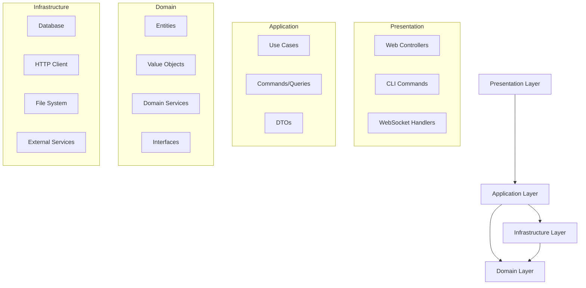

# Project Structure and Organization

## Directory Structure

```
dtxdownload/
├── docs/                           # Documentation
│   ├── requirements-and-architecture.md
│   ├── api-design.md
│   ├── database-schema.md
│   ├── deployment-guide.md
│   └── user-guide.md
├── src/                            # Source code
│   ├── core/                       # Core domain and shared utilities
│   │   ├── domain/                 # Domain entities and value objects
│   │   │   ├── entities/
│   │   │   │   ├── chart.entity.ts
│   │   │   │   ├── download.entity.ts
│   │   │   │   └── source.entity.ts
│   │   │   ├── value-objects/
│   │   │   │   ├── chart-id.vo.ts
│   │   │   │   ├── difficulty.vo.ts
│   │   │   │   ├── bpm.vo.ts
│   │   │   │   └── download-url.vo.ts
│   │   │   └── services/
│   │   │       ├── chart-validator.service.ts
│   │   │       ├── url-analyzer.service.ts
│   │   │       └── duplicate-detector.service.ts
│   │   ├── interfaces/              # Core interfaces and contracts
│   │   │   ├── repositories/
│   │   │   │   ├── chart.repository.ts
│   │   │   │   ├── download.repository.ts
│   │   │   │   └── source.repository.ts
│   │   │   ├── services/
│   │   │   │   ├── scraping.service.ts
│   │   │   │   ├── download.service.ts
│   │   │   │   └── chart.service.ts
│   │   │   └── strategies/
│   │   │       ├── scraping-strategy.interface.ts
│   │   │       └── download-provider.interface.ts
│   │   ├── errors/                  # Custom error types
│   │   │   └── index.ts
│   │   ├── types/                   # TypeScript type definitions
│   │   │   ├── common.types.ts
│   │   │   ├── chart.types.ts
│   │   │   ├── download.types.ts
│   │   │   └── api.types.ts
│   │   └── utils/                   # Shared utilities
│   │       ├── logger.ts
│   │       ├── config.ts
│   │       ├── validation.ts
│   │       └── async-helpers.ts
│   ├── application/                 # Application layer (use cases)
│   │   ├── use-cases/
│   │   │   ├── chart/
│   │   │   │   ├── add-chart.use-case.ts
│   │   │   │   ├── search-charts.use-case.ts
│   │   │   │   ├── update-chart.use-case.ts
│   │   │   │   └── delete-chart.use-case.ts
│   │   │   ├── download/
│   │   │   │   ├── download-chart.use-case.ts
│   │   │   │   ├── download-batch.use-case.ts
│   │   │   │   ├── cancel-download.use-case.ts
│   │   │   │   └── retry-download.use-case.ts
│   │   │   └── scraping/
│   │   │       ├── scrape-source.use-case.ts
│   │   │       ├── schedule-scraping.use-case.ts
│   │   │       └── validate-source.use-case.ts
│   │   ├── commands/                # Command objects
│   │   │   ├── chart.commands.ts
│   │   │   ├── download.commands.ts
│   │   │   └── scraping.commands.ts
│   │   ├── queries/                 # Query objects
│   │   │   ├── chart.queries.ts
│   │   │   ├── download.queries.ts
│   │   │   └── system.queries.ts
│   │   └── dtos/                    # Data Transfer Objects
│   │       ├── chart.dto.ts
│   │       ├── download.dto.ts
│   │       └── api-response.dto.ts
│   ├── infrastructure/              # Infrastructure layer
│   │   ├── database/
│   │   │   ├── repositories/
│   │   │   │   ├── chart.repository.impl.ts
│   │   │   │   ├── download.repository.impl.ts
│   │   │   │   └── source.repository.impl.ts
│   │   │   ├── migrations/
│   │   │   │   ├── 001_initial_schema.sql
│   │   │   │   ├── 002_add_full_text_search.sql
│   │   │   │   └── migration-runner.ts
│   │   │   ├── connection.ts
│   │   │   └── query-builder.ts
│   │   ├── http/
│   │   │   ├── client.ts
│   │   │   ├── rate-limiter.ts
│   │   │   └── retry-policy.ts
│   │   ├── file-system/
│   │   │   ├── file-storage.service.ts
│   │   │   └── temp-file.service.ts
│   │   ├── scraping/
│   │   │   ├── strategies/
│   │   │   │   ├── approved-dtx.strategy.ts
│   │   │   │   ├── base-scraping.strategy.ts
│   │   │   │   └── strategy-factory.ts
│   │   │   └── scraping.service.impl.ts
│   │   ├── downloads/
│   │   │   ├── providers/
│   │   │   │   ├── google-drive.provider.ts
│   │   │   │   ├── onedrive.provider.ts
│   │   │   │   ├── direct-download.provider.ts
│   │   │   │   └── provider-factory.ts
│   │   │   └── download.service.impl.ts
│   │   └── logging/
│   │       ├── winston.logger.ts
│   │       └── log-formatters.ts
│   ├── presentation/                # Presentation layer
│   │   ├── web/
│   │   │   ├── controllers/
│   │   │   │   ├── chart.controller.ts
│   │   │   │   ├── download.controller.ts
│   │   │   │   ├── source.controller.ts
│   │   │   │   └── system.controller.ts
│   │   │   ├── middleware/
│   │   │   │   ├── auth.middleware.ts
│   │   │   │   ├── validation.middleware.ts
│   │   │   │   ├── error-handler.middleware.ts
│   │   │   │   └── rate-limit.middleware.ts
│   │   │   ├── routes/
│   │   │   │   ├── chart.routes.ts
│   │   │   │   ├── download.routes.ts
│   │   │   │   ├── source.routes.ts
│   │   │   │   └── index.ts
│   │   │   ├── websocket/
│   │   │   │   ├── download-progress.handler.ts
│   │   │   │   ├── scraping-progress.handler.ts
│   │   │   │   └── websocket.server.ts
│   │   │   └── app.ts
│   │   ├── cli/
│   │   │   ├── commands/
│   │   │   │   ├── scrape.command.ts
│   │   │   │   ├── download.command.ts
│   │   │   │   └── export.command.ts
│   │   │   └── cli.ts
│   │   └── static/                  # Static web assets
│   │       ├── index.html
│   │       ├── css/
│   │       ├── js/
│   │       └── assets/
│   └── main.ts                      # Application entry point
├── tests/                           # Test files
│   ├── unit/
│   │   ├── core/
│   │   │   ├── domain/
│   │   │   └── services/
│   │   ├── application/
│   │   │   └── use-cases/
│   │   └── infrastructure/
│   │       ├── repositories/
│   │       └── services/
│   ├── integration/
│   │   ├── database/
│   │   ├── http/
│   │   └── scraping/
│   ├── e2e/
│   │   ├── api/
│   │   └── web/
│   ├── fixtures/
│   │   ├── charts.json
│   │   ├── html-samples/
│   │   └── test-database.sql
│   └── helpers/
│       ├── test-server.ts
│       ├── database-helpers.ts
│       └── mock-factories.ts
├── config/                          # Configuration files
│   ├── default.json
│   ├── development.json
│   ├── production.json
│   └── test.json
├── scripts/                         # Build and utility scripts
│   ├── build.ts
│   ├── migrate.ts
│   ├── seed-database.ts
│   └── generate-api-docs.ts
├── docker/                          # Docker configuration
│   ├── Dockerfile
│   ├── docker-compose.yml
│   └── docker-compose.dev.yml
├── .github/                         # GitHub Actions
│   └── workflows/
│       ├── ci.yml
│       ├── release.yml
│       └── deploy.yml
├── package.json
├── tsconfig.json
├── tsconfig.build.json
├── jest.config.js
├── .eslintrc.js
├── .prettierrc
├── .gitignore
└── README.md
```

## Module Dependencies



## File Naming Conventions

### General Rules
- Use kebab-case for directories: `chart-management/`
- Use kebab-case for files: `chart-validator.service.ts`
- Use PascalCase for classes: `ChartValidator`
- Use camelCase for functions and variables: `validateChart()`

### File Suffixes

```typescript
// Entities
*.entity.ts          // Domain entities
*.vo.ts              // Value objects

// Services and Use Cases
*.service.ts         // Service implementations
*.use-case.ts        // Application use cases
*.strategy.ts        // Strategy pattern implementations
*.provider.ts        // Provider pattern implementations

// Infrastructure
*.repository.ts      // Repository interfaces
*.repository.impl.ts // Repository implementations
*.controller.ts      // Web controllers
*.middleware.ts      // Express middleware

// Testing
*.test.ts           // Unit tests
*.spec.ts           // Integration tests
*.e2e.ts            // End-to-end tests

// Configuration
*.config.ts         // Configuration files
*.types.ts          // Type definitions
*.dto.ts            // Data Transfer Objects
```

## Import/Export Patterns

### Barrel Exports
Each directory should have an `index.ts` file that re-exports public APIs:

```typescript
// src/core/domain/entities/index.ts
export { Chart } from './chart.entity';
export { Download } from './download.entity';
export { Source } from './source.entity';

// src/core/domain/index.ts
export * from './entities';
export * from './value-objects';
export * from './services';
```

### Import Rules
```typescript
// 1. Node.js built-in modules
import * as fs from 'fs';
import * as path from 'path';

// 2. Third-party modules
import express from 'express';
import { Database } from 'sqlite3';

// 3. Internal modules (absolute imports)
import { Chart } from '@/core/domain/entities';
import { ChartRepository } from '@/core/interfaces/repositories';

// 4. Relative imports (only for closely related files)
import { BaseEntity } from './base.entity';
```

## Dependency Injection Setup

### Container Configuration
```typescript
// src/infrastructure/di/container.ts
import { Container } from 'inversify';
import { TYPES } from './types';
import { ChartRepository } from '@/core/interfaces/repositories';
import { ChartRepositoryImpl } from '@/infrastructure/database/repositories';

const container = new Container();

// Repositories
container.bind<ChartRepository>(TYPES.ChartRepository).to(ChartRepositoryImpl);

// Services
container.bind<ScrapingService>(TYPES.ScrapingService).to(ScrapingServiceImpl);

// Use Cases
container.bind<AddChartUseCase>(TYPES.AddChartUseCase).to(AddChartUseCase);

export { container };
```

### Service Identifiers
```typescript
// src/infrastructure/di/types.ts
export const TYPES = {
  // Repositories
  ChartRepository: Symbol.for('ChartRepository'),
  DownloadRepository: Symbol.for('DownloadRepository'),
  
  // Services
  ScrapingService: Symbol.for('ScrapingService'),
  DownloadService: Symbol.for('DownloadService'),
  
  // Use Cases
  AddChartUseCase: Symbol.for('AddChartUseCase'),
  SearchChartsUseCase: Symbol.for('SearchChartsUseCase'),
  
  // Infrastructure
  Database: Symbol.for('Database'),
  Logger: Symbol.for('Logger'),
  HttpClient: Symbol.for('HttpClient'),
};
```

## Configuration Management

### Environment-based Config
```typescript
// config/default.json
{
  "server": {
    "port": 3000,
    "host": "localhost"
  },
  "database": {
    "path": "./data/dtx.db"
  },
  "downloads": {
    "directory": "./downloads",
    "concurrency": 3
  }
}

// config/production.json
{
  "server": {
    "port": 8080,
    "host": "0.0.0.0"
  },
  "database": {
    "path": "/data/dtx.db"
  }
}
```

### Type-safe Configuration
```typescript
// src/core/utils/config.ts
interface AppConfig {
  server: {
    port: number;
    host: string;
  };
  database: {
    path: string;
  };
  downloads: {
    directory: string;
    concurrency: number;
  };
}

export const config: AppConfig = require('config');
```

## Error Handling Strategy

### Error Propagation
```typescript
// Domain Layer: Throw domain-specific errors
if (!chart.isValid()) {
  throw new ChartValidationError('Invalid chart data');
}

// Application Layer: Handle and transform errors
try {
  return await this.chartRepository.save(chart);
} catch (error) {
  if (error instanceof DuplicateKeyError) {
    throw new ChartAlreadyExistsError(chart.id);
  }
  throw error;
}

// Presentation Layer: Convert to HTTP responses
try {
  const result = await this.addChartUseCase.execute(command);
  return res.status(201).json(result);
} catch (error) {
  return this.errorHandler.handle(error, res);
}
```

## Testing Strategy

### Test Organization
```typescript
// tests/unit/core/domain/entities/chart.entity.test.ts
describe('Chart Entity', () => {
  describe('constructor', () => {
    it('should create valid chart with required fields', () => {
      // Test implementation
    });
  });
  
  describe('validate', () => {
    it('should return true for valid chart', () => {
      // Test implementation
    });
  });
});

// tests/integration/infrastructure/repositories/chart.repository.test.ts
describe('Chart Repository Integration', () => {
  beforeEach(async () => {
    await setupTestDatabase();
  });
  
  it('should save and retrieve chart', async () => {
    // Test implementation
  });
});
```

### Mock Strategies
```typescript
// tests/helpers/mock-factories.ts
export class MockChartFactory {
  static create(overrides?: Partial<Chart>): Chart {
    return new Chart({
      id: new ChartId('test-id'),
      title: 'Test Chart',
      artist: 'Test Artist',
      // ... other properties
      ...overrides
    });
  }
}

// In tests
const mockChart = MockChartFactory.create({ title: 'Custom Title' });
```

## Build and Deployment

### Build Scripts
```typescript
// scripts/build.ts
import { build } from 'esbuild';
import { copyFileSync } from 'fs';

async function buildApp() {
  await build({
    entryPoints: ['src/main.ts'],
    bundle: true,
    platform: 'node',
    target: 'node16',
    outfile: 'dist/app.js',
    external: ['sqlite3'],
  });
  
  // Copy static assets
  copyFileSync('src/presentation/static', 'dist/static');
}

buildApp().catch(console.error);
```

### Docker Setup
```dockerfile
# docker/Dockerfile
FROM node:18-alpine

WORKDIR /app

COPY package*.json ./
RUN npm ci --only=production

COPY dist/ ./dist/
COPY config/ ./config/

EXPOSE 3000
CMD ["node", "dist/app.js"]
```

This project structure provides:

1. **Clear Separation of Concerns**: Each layer has specific responsibilities
2. **Scalability**: Easy to add new features and sources
3. **Testability**: Each component can be tested in isolation
4. **Maintainability**: Well-organized code with consistent patterns
5. **Type Safety**: Full TypeScript coverage with strict configuration
6. **Documentation**: Comprehensive docs for all aspects of the system

The structure follows Domain-Driven Design principles while remaining practical for a Node.js application.
