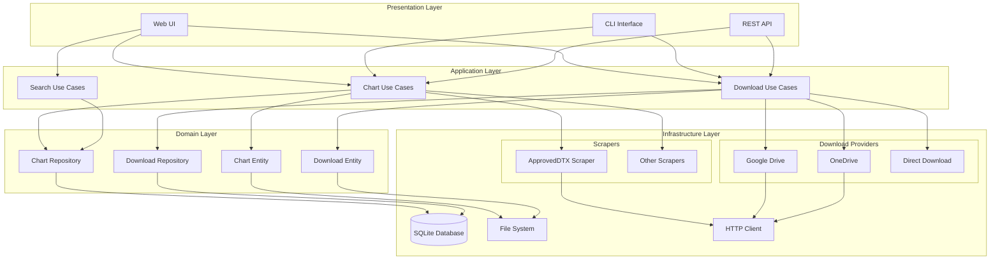
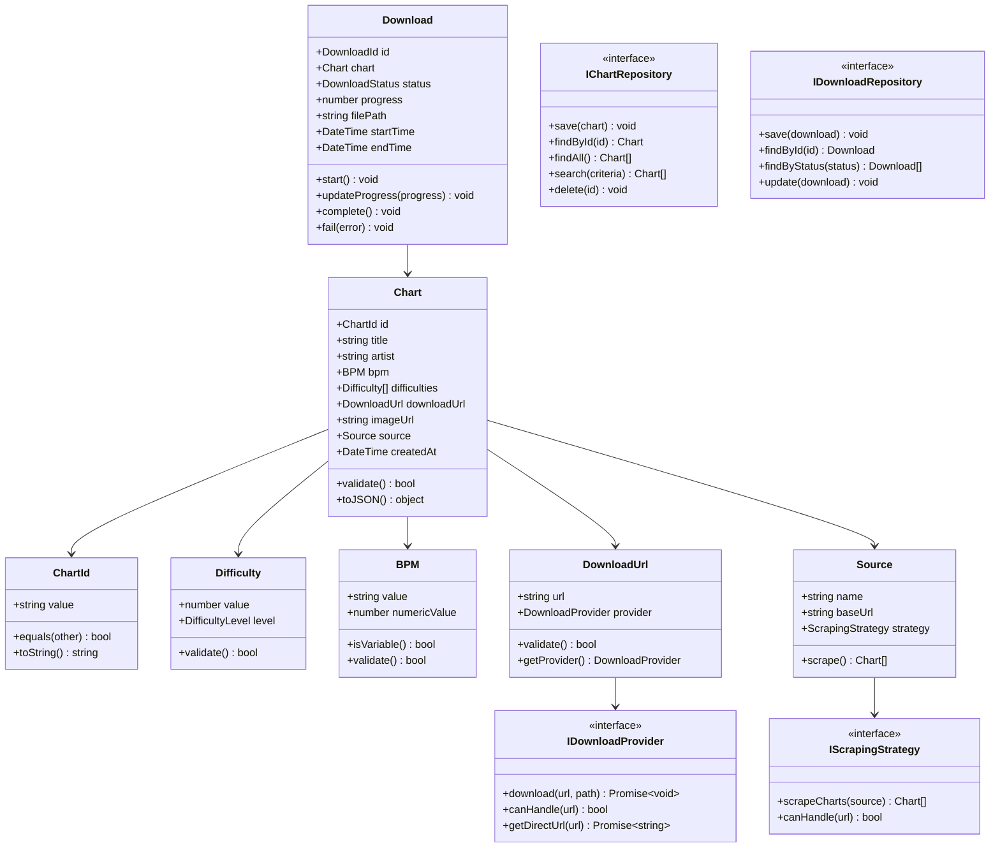
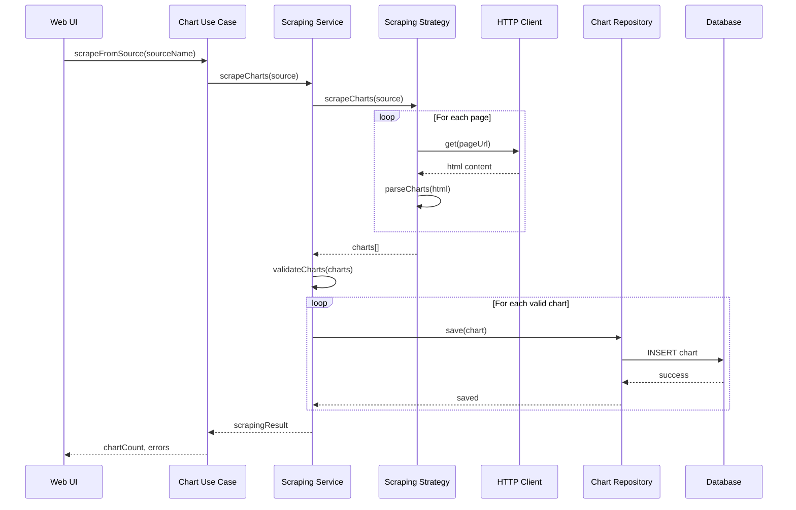
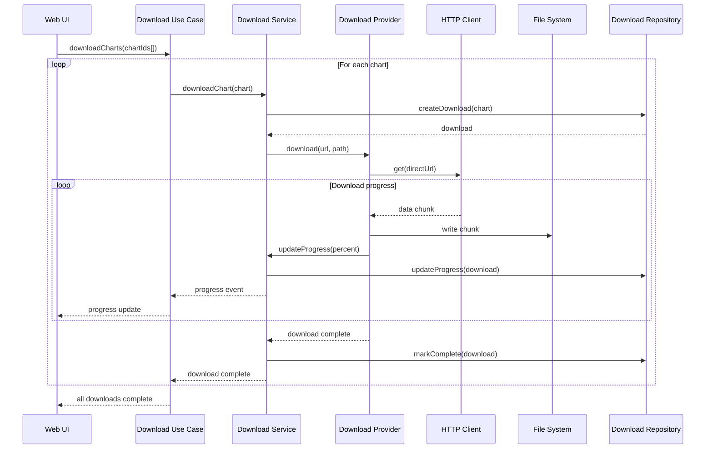

# DTX Download Tool - Requirements and Architecture

## Table of Contents
1. [Requirements](#requirements)
2. [Architecture Overview](#architecture-overview)
3. [Domain Model](#domain-model)
4. [System Design](#system-design)
5. [UML Diagrams](#uml-diagrams)
6. [Implementation Plan](#implementation-plan)

## Requirements

### Functional Requirements

#### Core Features
1. **Chart Discovery**: Scrape DTXMania charts from multiple sources (blogs, websites)
2. **Chart Management**: Store, search, filter, and organize chart metadata
3. **Download Management**: Download charts from various cloud providers (Google Drive, OneDrive, etc.)
4. **Web Interface**: Browse and select charts for download via a web UI
5. **Batch Operations**: Download multiple charts in sequence or parallel

#### Data Requirements
- **Chart Metadata**: Title, Artist, BPM, Difficulties, Source URL, Download URL, Preview Image
- **Source Management**: Support multiple chart sources with different scraping strategies
- **Download Tracking**: Track download progress, success/failure status
- **Storage**: Persistent storage for chart database and downloaded files

#### Quality Requirements
- **Extensibility**: Easy to add new chart sources and download providers
- **Reliability**: Robust error handling and retry mechanisms
- **Performance**: Efficient scraping and downloading with rate limiting
- **Maintainability**: Clean, well-documented, testable code

### Non-Functional Requirements

#### Performance
- Handle 1000+ charts in database efficiently
- Support concurrent downloads (configurable concurrency)
- Web interface should load < 2s for 1000 charts

#### Reliability
- 99% uptime for local operations
- Graceful degradation when sources are unavailable
- Comprehensive error logging and recovery

#### Usability
- Simple web interface for chart browsing
- Clear progress indication for downloads
- Intuitive filtering and search

#### Security
- Safe handling of external URLs and file downloads
- Input validation and sanitization
- No execution of downloaded content

## Architecture Overview

### High-Level Architecture

The system follows a **layered architecture** with clear separation of concerns:

```
┌─────────────────────────────────────────┐
│           Presentation Layer            │
│  (Web UI, CLI, API Endpoints)          │
├─────────────────────────────────────────┤
│           Application Layer             │
│  (Use Cases, Commands, Queries)        │
├─────────────────────────────────────────┤
│             Domain Layer                │
│  (Entities, Value Objects, Services)   │
├─────────────────────────────────────────┤
│          Infrastructure Layer           │
│  (Database, HTTP, File System)         │
└─────────────────────────────────────────┘
```

### Design Principles

1. **Dependency Inversion**: High-level modules don't depend on low-level modules
2. **Single Responsibility**: Each class has one reason to change
3. **Open/Closed**: Open for extension, closed for modification
4. **Interface Segregation**: Clients depend only on interfaces they use
5. **Strategy Pattern**: Pluggable scrapers and download providers

### Key Patterns

- **Repository Pattern**: Data access abstraction
- **Strategy Pattern**: Interchangeable scrapers and downloaders
- **Factory Pattern**: Create scrapers and downloaders
- **Observer Pattern**: Progress tracking and notifications
- **Command Pattern**: Encapsulate download operations

## Domain Model

### Core Entities

#### Chart
- **Identity**: Unique identifier
- **Properties**: Title, Artist, BPM, Difficulties, URLs, Metadata
- **Behavior**: Validation, serialization

#### Source
- **Identity**: Source name/URL
- **Properties**: Configuration, scraping strategy
- **Behavior**: Chart discovery and extraction

#### Download
- **Identity**: Download ID
- **Properties**: Status, progress, file info
- **Behavior**: State transitions, progress tracking

### Value Objects

- **ChartId**: Immutable chart identifier
- **Difficulty**: Validated difficulty level
- **BPM**: Beats per minute with validation
- **DownloadUrl**: Validated URL with provider detection
- **FilePath**: Safe file path handling

### Domain Services

- **ChartValidator**: Validates chart data integrity
- **UrlAnalyzer**: Determines download provider from URL
- **DuplicateDetector**: Identifies duplicate charts

## System Design

### Component Diagram



### Class Diagram



### Sequence Diagram - Chart Scraping



### Sequence Diagram - Chart Download



## Implementation Plan

### Phase 1: Core Domain and Infrastructure
1. **Domain Models**: Chart, Download, Value Objects
2. **Core Interfaces**: Repositories, Services
3. **Error Handling**: Custom exceptions, error types
4. **Configuration**: Settings management
5. **Logging**: Structured logging setup

### Phase 2: Data Layer
1. **Database Schema**: SQLite tables for charts and downloads
2. **Repository Implementation**: Chart and Download repositories
3. **Migrations**: Database versioning
4. **Data Validation**: Input sanitization and validation

### Phase 3: Scraping System
1. **Scraping Framework**: Base scraper, strategy pattern
2. **ApprovedDTX Scraper**: First concrete implementation
3. **Rate Limiting**: Respect source servers
4. **Error Handling**: Robust error recovery

### Phase 4: Download System
1. **Download Framework**: Base provider, strategy pattern
2. **Google Drive Provider**: Handle virus check, direct links
3. **OneDrive Provider**: Share link to direct URL conversion
4. **Progress Tracking**: Real-time download progress

### Phase 5: Application Layer
1. **Use Cases**: Chart management, download orchestration
2. **Command/Query Separation**: Clear read/write operations
3. **Transaction Management**: Ensure data consistency
4. **Caching**: Performance optimization

### Phase 6: Presentation Layer
1. **Web API**: RESTful endpoints
2. **Web UI**: Modern, responsive interface
3. **CLI**: Command-line interface for automation
4. **Real-time Updates**: WebSocket for progress

### Phase 7: Advanced Features
1. **Concurrent Downloads**: Parallel processing
2. **Resume Downloads**: Handle interruptions
3. **Duplicate Detection**: Smart chart matching
4. **Export/Import**: Database backup and restore

### Phase 8: Quality and Deployment
1. **Testing**: Unit, integration, and E2E tests
2. **Documentation**: API docs, user guides
3. **Performance**: Optimization and profiling
4. **Packaging**: Distribution and deployment

## Technology Stack

### Core
- **TypeScript**: Type safety and modern JS features
- **Node.js**: Runtime environment
- **SQLite**: Embedded database

### Dependencies
- **cheerio**: HTML parsing for scraping
- **axios**: HTTP client with interceptors
- **express**: Web framework
- **ws**: WebSocket support
- **joi**: Schema validation

### Development
- **Jest**: Testing framework
- **ESLint + Prettier**: Code quality
- **TypeScript**: Type checking
- **Nodemon**: Development server

### Build and Deploy
- **esbuild**: Fast bundling
- **Docker**: Containerization
- **GitHub Actions**: CI/CD
